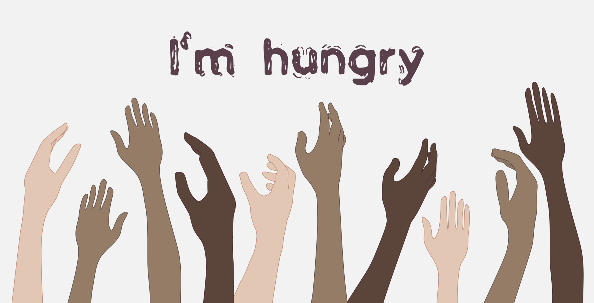

# 🥗 ShareTheMeal

Welcome to **ShareTheMeal** – a community-driven platform to share surplus food with those in need.  
Reduce food waste, spread kindness, and help build a more caring world, one meal at a time.



---

## 🌟 Features

- **Share a Meal:** Fill out a simple form to offer extra food.
- **See Available Meals:** Browse a public list of meals shared by others.
- **Beautiful, Responsive Design:** Visually appealing and mobile-friendly.
- **Thank You Experience:** Contributors are greeted with a heartfelt thank you message.
- **Privacy:** Contact details are not shown publicly.

---

## 🚀 Getting Started

1. **Clone the repository:**
   ```bash
   git clone https://github.com/yourusername/share-the-meal.git
   cd share-the-meal
   ```

2. **Install dependencies:**
   ```bash
   npm install
   ```

3. **Add your background image:**
   - Place a file named `Hunger.jpg` in the project root directory for the best visual experience.

4. **Start the server:**
   ```bash
   node index.js
   ```
   The app will run at [http://localhost:5000](http://localhost:5000)

---

## 📸 Screenshots

| Home Page | Share Form | Thank You |
|-----------|------------|-----------|
|  |  |  |

---

> **Thank you for helping fight hunger and food waste!**
